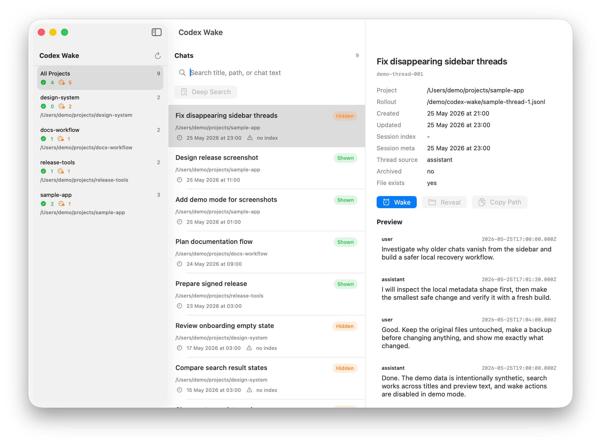

# Codex Wake

Codex Desktop currently hides chats older than about one week from the sidebar, even when the app setting says not to delete chats. The conversations are usually still on disk, but they become hard to find and continue.

Another common pain: useful chats can end up attached to the wrong project, which makes them hard to find in the right workspace later.

Codex Wake is an unofficial local macOS app for browsing, searching, waking, and moving Codex chats. It reads the local Codex data directory, shows chats grouped by project, supports metadata search and optional deep search through JSONL transcripts, can "wake" a selected chat so it appears again in the Codex sidebar, and can move a chat from one known project to another.



## Update

Codex Wake can now move chats between projects. Select a chat, click **Move**, choose the target project, and the app updates the local project metadata with backups first.

## Download

Download the latest macOS build from [Releases](https://github.com/nClear/codex-wake/releases).

The release build is signed with a Developer ID certificate and notarized by Apple.

To install it:

1. Download `Codex-Wake-0.1.0-macOS.zip`.
2. Unzip the archive.
3. Move `Codex Wake.app` to `/Applications`.
4. Open it.

## Demo Mode

Codex Wake includes a screenshot-safe demo mode with synthetic projects and chats. It does not read or write `~/.codex`.

```sh
open -n "dist/Codex Wake.app" --args --demo
```

You can also launch the app with:

```sh
CODEX_WAKE_DEMO=1 "dist/Codex Wake.app/Contents/MacOS/CodexWake"
```

## Features

- Browse local Codex chat threads grouped by project.
- Search by title, first message, preview text, path, or thread id.
- Run optional deep search inside chat JSONL files.
- Preview messages from a selected thread without opening Codex.
- Wake a thread by updating the local metadata Codex uses for recent/sidebar visibility.
- Move a thread between known projects by updating its local project metadata.
- Create backups before every wake operation.
- Reveal a thread JSONL file in Finder or copy its path.

## What It Reads

Codex Wake reads local files from:

```text
~/.codex/state_5.sqlite
~/.codex/session_index.jsonl
~/.codex/sessions/**/*.jsonl
```

The app does not send chat content anywhere. There is no server component, telemetry, analytics, or network sync.

## Wake Operation

When you wake a selected thread, Codex Wake creates timestamped backups and then updates only the metadata needed to make the thread look recent to Codex Desktop:

- `threads.thread_source = 'user'`
- `threads.updated_at` and `threads.updated_at_ms`
- `session_index.jsonl.updated_at`
- the first `session_meta` line in the thread JSONL file: `timestamp` and `payload.timestamp`

The chat messages themselves are not modified.

Backups are written next to the original files with a timestamp suffix.

## Move Operation

When you move a selected thread, Codex Wake creates timestamped backups and updates the project path metadata Codex uses for grouping:

- `threads.cwd`
- the first `session_meta` line in the thread JSONL file: `payload.cwd`

After the move, Codex Wake reloads the full thread list so project counts and filters reflect the new location.

## Build

Requirements:

- macOS 14 or newer
- Swift 6 toolchain

Build the executable:

```sh
swift build
```

Build a macOS `.app` bundle:

```sh
./scripts/build-app.sh
```

The app bundle is written to:

```text
dist/Codex Wake.app
```

## Safety Notes

Codex Wake edits local Codex metadata when you press **Wake** or **Move**. Keep Codex Desktop closed while changing old threads if you want to avoid concurrent writes.

If something looks wrong after a wake operation, restore the backup files shown in the wake report.

## Status

Early utility. Tested on local Codex Desktop data, but the Codex storage format is private and may change.

## Disclaimer

Codex Wake is unofficial and is not affiliated with OpenAI.

## License

MIT
